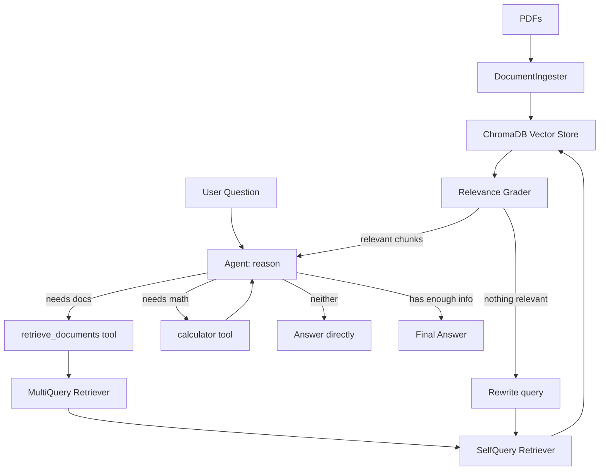

# 🧠 DocuChat — Agentic RAG Pipeline

A configurable Retrieval-Augmented Generation (RAG) chatbot that answers questions grounded in any document set. Upload PDFs, customize the agent's instructions for your domain, and get answers strictly based on your documents — not the LLM's training data.

Built with LangChain, LangGraph, ChromaDB, HuggingFace embeddings, and Google Gemini.

---

## 🏗️ Architecture

DocuChat uses a **ReAct agent** (LangGraph) that reasons about each question and decides, turn by turn, which tool (if any) to call before answering.

**How a question flows through the agent:**
1. The agent (Gemini) reads the question and decides whether it needs a tool.
2. If it calls `retrieve_documents`: the query goes through Multi-Query (paraphrased query variants) → Self-Query (metadata-aware filtering, e.g. by source filename or page) → ChromaDB similarity search → a relevance grader that scores each returned chunk. If nothing passes grading, the query is automatically rewritten and retried once.
3. If it calls `calculator`: the expression is evaluated safely via `sympy` (no raw `eval`).
4. The agent can call tools more than once per question (e.g. retrieve a fact, then calculate with it) before producing a final answer.
5. If the question is off-topic for the documents entirely, the agent answers directly or declines, per its system prompt — no retrieval is wasted on it.

---

## ✨ Features

- 🤖 **ReAct agent** (LangGraph) — decides which tool to use per question instead of following a fixed pipeline
- 📄 Upload multiple PDFs directly from the UI
- 🔍 Semantic search over document contents using `all-MiniLM-L6-v2` embeddings
- 🔁 MultiQuery query translation to generate diverse paraphrased retrieval queries
- 🧠 SelfQuery retrieval for query construction and metadata-aware filtering
- ✅ **Relevance grading** — retrieved chunks are scored for relevance before being used; irrelevant ones are discarded
- 🔄 **Automatic query rewriting** — if grading finds nothing relevant, the question is rephrased and retried once before giving up
- 🧮 **Calculator tool** — the agent can do arithmetic instead of guessing at numbers
- 🤖 Answers grounded strictly in uploaded documents (agent is instructed never to answer document questions from memory)
- 📚 Shows source chunks used to generate each answer
- 🔄 Retry logic with exponential backoff for API resilience
- ⚙️ Centralized configuration via `config.py`
- 🧹 Clean reset to swap document sets anytime

Note: In environments with incompatible LangChain package versions, the retrieval pipeline falls back to MultiQuery-only (or base similarity search) automatically.

## ✏️ Custom Agent Instructions

The sidebar lets you edit the agent's system prompt — the rules it follows for when to use each tool and how strictly to stay grounded in the documents. This makes the pipeline adaptable to any domain.