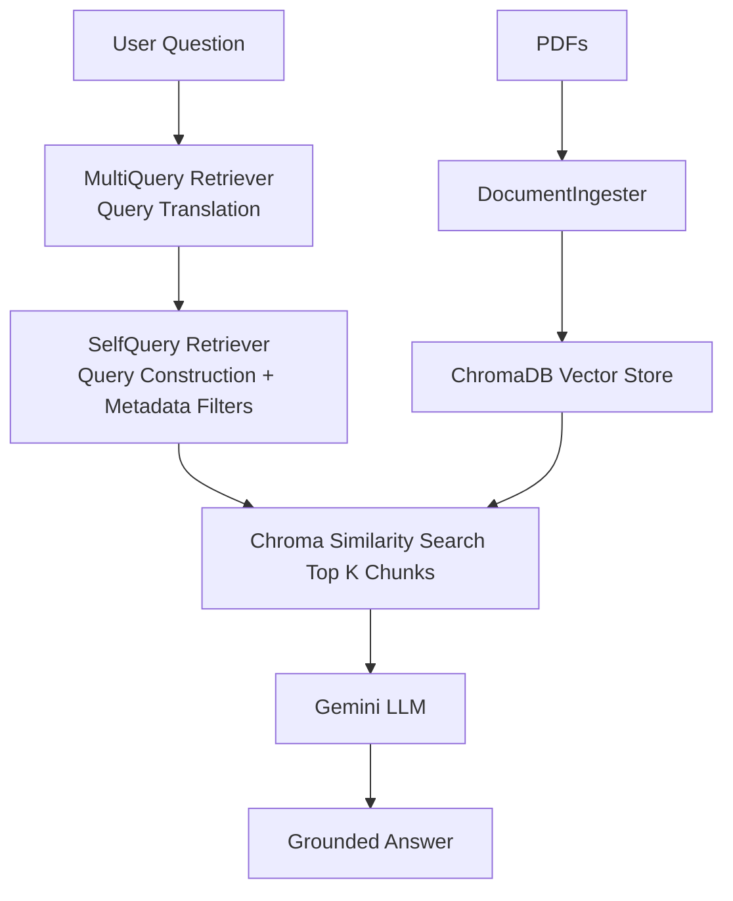

# 🧠 DocuChat — Generic RAG Pipeline

A configurable Retrieval-Augmented Generation (RAG) chatbot that answers questions grounded in any document set. Upload PDFs, customize the prompt template for your domain, and get answers strictly based on your documents — not the LLM's training data.

Built with LangChain, ChromaDB, HuggingFace embeddings, and Google Gemini.

---

## 🏗️ Architecture



---

## ✨ Features

- 📄 Upload multiple PDFs directly from the UI
- 🔍 Semantic search over document contents using `all-MiniLM-L6-v2` embeddings
- 🔁 MultiQuery query translation to generate diverse paraphrased retrieval queries
- 🧠 SelfQuery retrieval for query construction and metadata-aware filtering
- 🤖 Answers grounded strictly in uploaded documents
- 📚 Shows source chunks used to generate each answer
- 🔄 Retry logic with exponential backoff for API resilience
- ⚙️ Centralized configuration via `config.py`
- 🧹 Clean reset to swap document sets anytime

Note: In environments with incompatible LangChain package versions, the pipeline falls back to MultiQuery-only retrieval automatically.

 
## ✏️ Custom Prompt Templates
 
The sidebar lets you customize how the AI answers. This makes the pipeline adaptable to any domain:
 
**Legal documents:**
```
You are a legal assistant. Answer strictly from the context below.
If not found, say "This information is not in the provided documents."
Context: {context}
Question: {question}
Answer:
```
 
**Healthcare policy documents:**
```
You are a healthcare document assistant. Use only the provided context.
Do not make assumptions beyond what is stated.
Context: {context}
Question: {question}
Answer:
```
 
> ⚠️ Prompt must always contain `{context}` and `{question}` placeholders.
 
---

## 🛠️ Tech Stack

| Component      | Technology                       |
|----------------|----------------------------------|
| LLM            | Google Gemini                    |
| Embeddings     | HuggingFace                      |
| Vector Store   | ChromaDB                         |
| RAG Framework  | LangChain                        |
| Observability  | LangSmith (tracing/debugging)    |
| UI             | Streamlit                        |

---

## ⚙️ Setup

### 1. Clone the repository
```bash
git clone https://github.com/raghava7129/ml_research_rag.git
cd ml_research_rag
```

### 2. Create and activate virtual environment
```bash
python -m venv venv
source venv/bin/activate       # Linux/Mac
venv\Scripts\activate          # Windows
```

### 3. Install dependencies
```bash
pip install -r requirements.txt
```

### 4. Set up environment variables
Create a `.env` file in the project root:
```
GOOGLE_API_KEY=your_google_api_key_here
LANGSMITH_API_KEY=your_langsmith_api_key_here
LANGSMITH_TRACING=true
LANGSMITH_PROJECT=ml-research-rag
```
Get your free API key from [Google AI Studio](https://aistudio.google.com/).

If you do not want tracing, set `LANGSMITH_TRACING=false`.

### 5. Run the app
```bash
streamlit run app.py
```

Open your browser at `http://localhost:8501`

## 📈 LangSmith Tracing

When `LANGSMITH_TRACING=true` and `LANGSMITH_API_KEY` is set, every LangChain run is logged to LangSmith.

Where to check outputs:
- Go to [LangSmith](https://smith.langchain.com/)
- Open your project (default: `ml-research-rag`)
- Check the **Runs** / **Traces** view for each user query, retriever calls, and model outputs

Tip: In the app sidebar you will see whether tracing is ON or OFF.

## 🚀 Deployment

This project is deployed on [Hugging Face Spaces](https://huggingface.co/spaces).

Set these secrets in your Hugging Face Space settings:
- `GOOGLE_API_KEY`
- `LANGSMITH_API_KEY`
- `LANGSMITH_TRACING=true`
- `LANGSMITH_PROJECT=ml-research-rag`